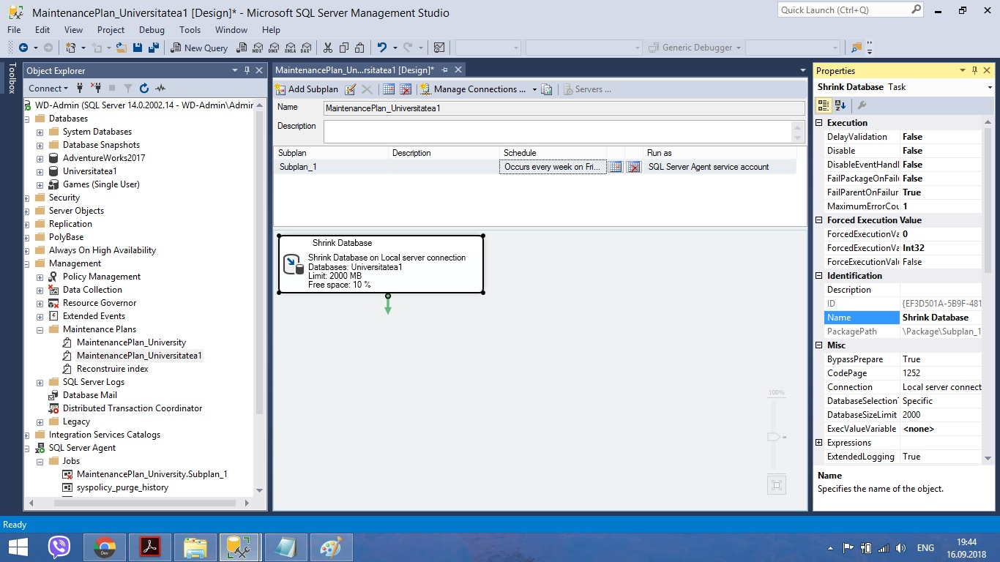
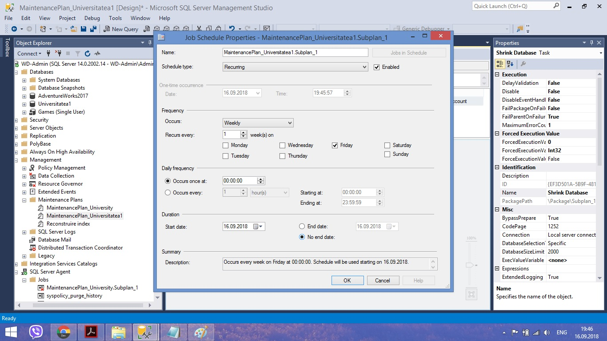
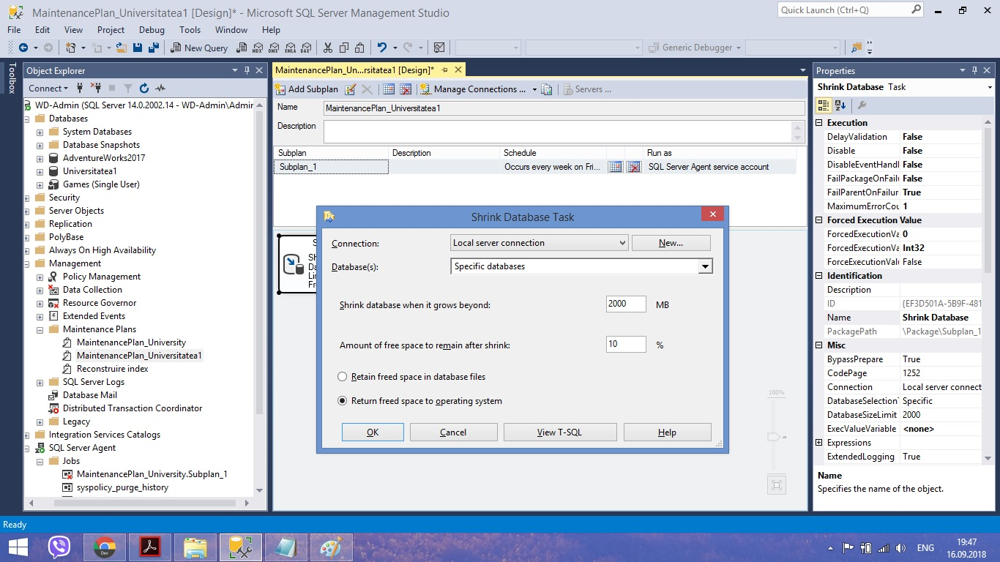
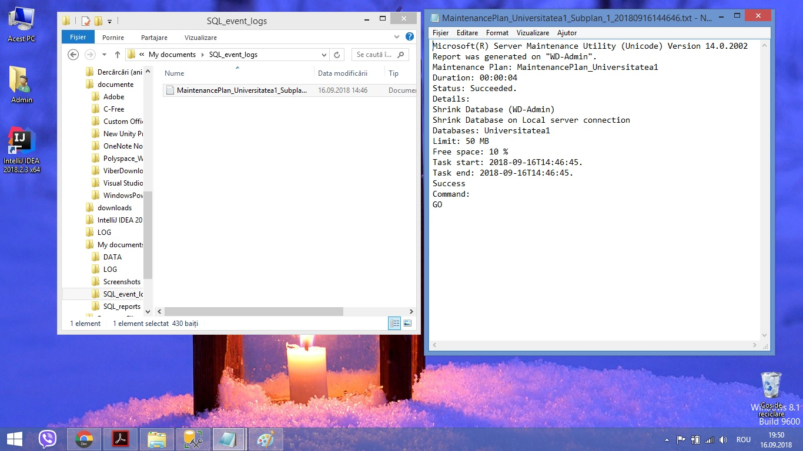
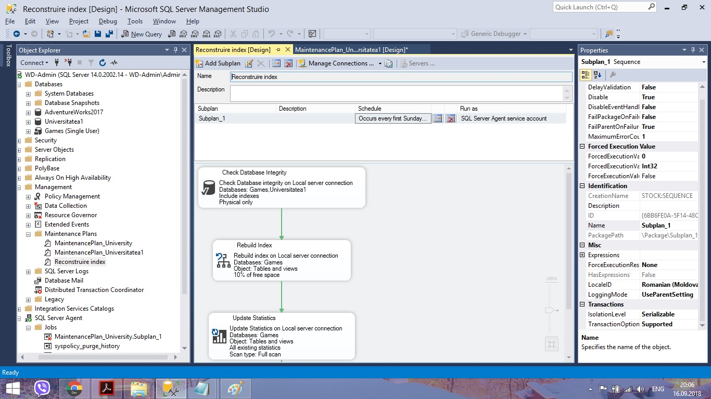
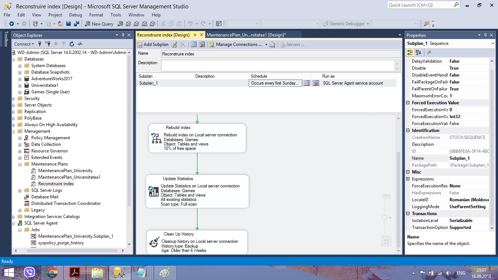
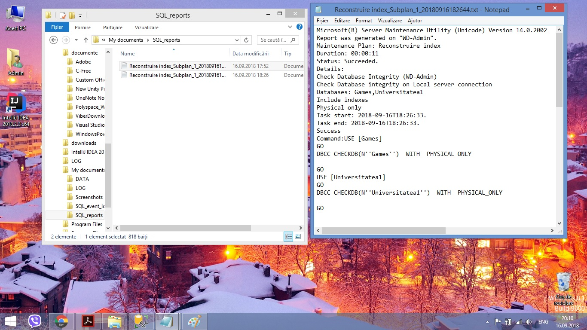
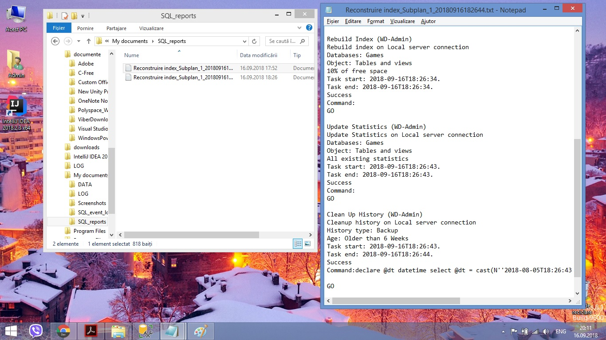

# Laboratory-nr2
Topic: Creating and maintaining the database
SQL laboratories
<h2>Exercise 1.</h2>
       
 I created a new database with necessary caracteristics and a new filegroup named "Univer" with some properties</>
       <h1> </h1>
       
<h2>Exercise 2.</h2>
       
 I created an another database named Games.

       
       
 The long file name differs from the logical one defined in the physical schema.

       
       
 The database is accessible for only one user</>
       
<h2>Exercise 3.</h2>
       
 I created the plan to maintain the first database named MentenancePlan_Universitatea1 

       
       
 This operation runs every Friday at 00:00 

       
       
 Unused space from database files is removed when reaching the limit of 2000Mb 

       
       
 Check the results in the <I>log</I> file

       
<h2>Exercise 4.</h2>
       
 I created the Mentenance Plan for my second database named Games which include :

       <ul> <li>The system performs rebuilding of indexes only on the base tables
            <li>The free space on the page is 10% 
            <li>Indexes sorting is done in <I>tempdb</I> 
            <li>After rebuilding, there is a collection of complete statistics about reconstructed indexes
            <li>Delete history older than 6 weeks for Backup restore operations
            <li>The plan runs every first Sunday of the month
      </ul>
      

              

              
              

              

              
              

      

      
 Check the results in the <I>log</I> file

       

              

              
              

              

              
              

      

