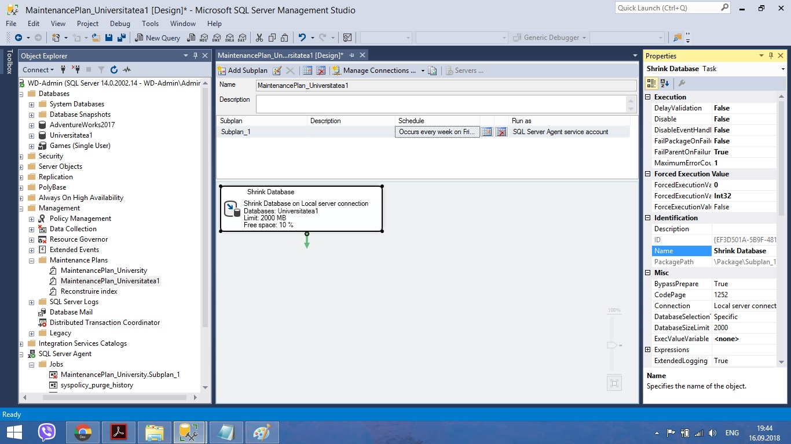

# Laboratory-nr1
SQL laboratories
<h2>Exercise 1.</h2>
       
 I created a new database with necessary caracteristics and a new filegroup named "Univer" with some properties</>
       <h1> </h1>
       
<h2>Exercise 2.</h2>
       
 I created an another database named Games.

       
       
 The long file name differs from the logical one defined in the physical schema.

       
       
 The database is accessible for only one user</>
       
<h2>Exercise 3.</h2>
       
 I created the plan to maintain the first database 

       
